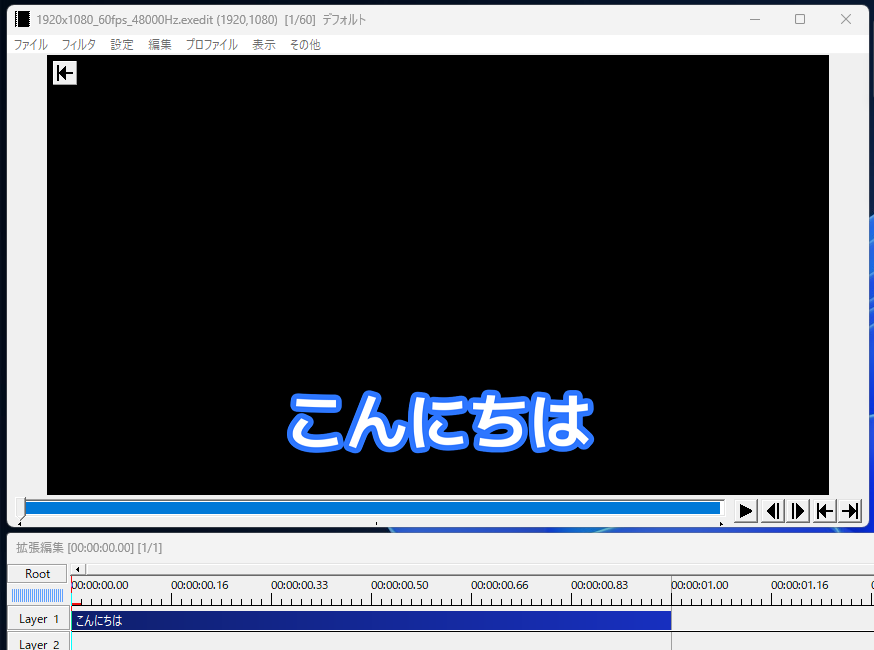
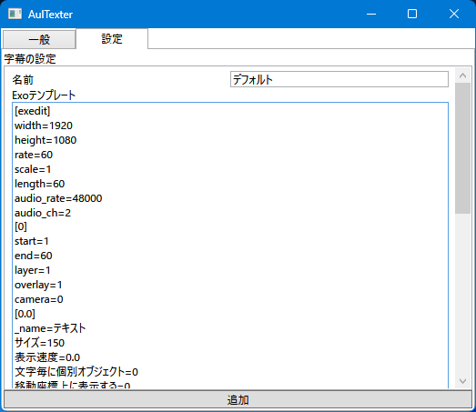
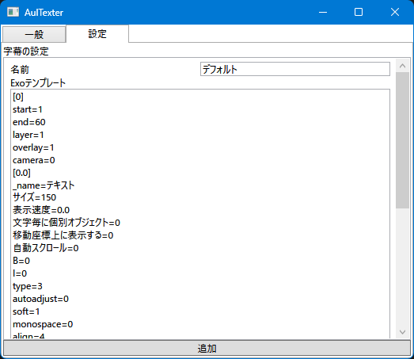
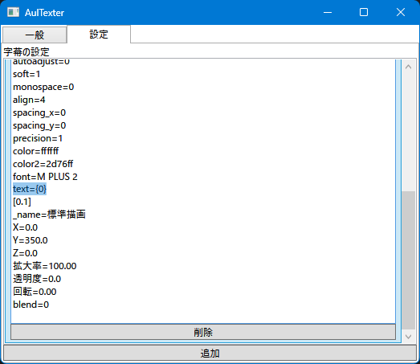

# AulTexter
入力された内容からExoファイルを生成します

# 設定の作り方
まずAviUtlで字幕を作りExoファイルとして出力します。  
  
  
次にAulTexterを起動し設定タブの追加ボタンを押して設定を追加します（名前は適当に付けてください）  
そうしたらExoテンプレートの欄に先ほど出力したExoファイルの中身をコピーします。  
  
  
最後に`[0]`より上のテキストを削除し、`text=459abe75900000...`を`text={0}`に変えます。  
  
  
  
これにて設定の作り方は以上です。別の字幕設定を作りたい場合は、AviUtlで別のExoを作り同じ手順を踏んでください。  

# 使い方
字幕としたいテキストをテキストボックスに入力し、「Exoファイルを作成 & AviUtlへD&D」をAviUtlの拡張編集にD&Dしてください。